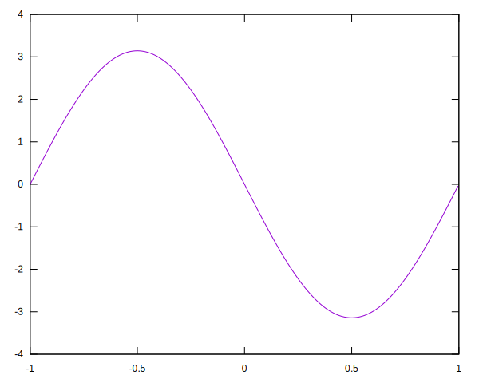
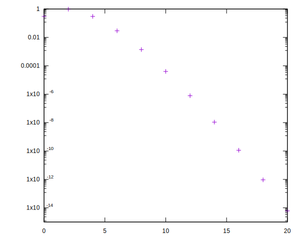
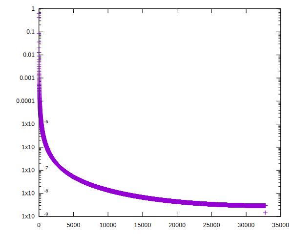
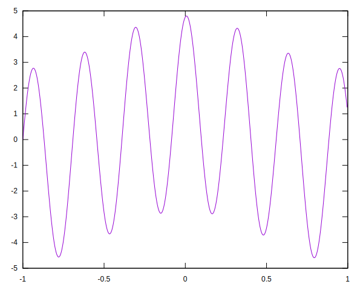

# approxfun

A library for efficient computation of numeric functions using approximation theory.

## System Requirements

`approxfun` depends crucially on two numerical libraries, which must be installed and accessible via your CFFI search path
- [libfftw3](http://www.fftw.org/)
- [LAPACK](http://www.netlib.org/lapack/)

The plotting functionality requires [Gnuplot](http://www.gnuplot.info/) to be installed and in your PATH.


## An Extended Example

First, choose a suitable domain for work with. At the present, this means identifying an interval of the real numbers.

```
APPROXFUN> (multiple-value-bind (%omega %x) (make-domain -1 1)
             (defvar omega %omega)
             (defvar x %x))
X
APPROXFUN> x
#<CHEBYSHEV-APPROXIMANT (2) on [-1.000, 1.000] {100955EB63}>
```

Here `x` denotes the function x |-> x on (-1, 1). We can construct other functions from this, by arithmetic and composition. We can evaluate functions using the `@` operator.

```
APPROXFUN> (defvar b (cos (* pi x)))
B
APPROXFUN> b
#<CHEBYSHEV-APPROXIMANT (21) on [-1.000, 1.000] {1006A45683}>
APPROXFUN> (@ b 1d0)
-1.0d0
```

We represent functions via [Chebyshev interpolants](https://en.wikipedia.org/wiki/Chebyshev_polynomials). Functions are adaptively sampled until an adequate polynomial fit is made. For `cos(pi*x)`, this is 20th degree polynomial (so, 21 coefficients), as indicated in the printed representation. We can get our hands on these explicitly, as follows.

```
APPROXFUN> (subseq (chebyshev-approximant-coeffs b) 0 5)
#(#C(-0.3042421776440938d0 0.0d0) #C(0.0d0 0.0d0)
  #C(-0.9708678652630182d0 -1.1102230246251566d-17) #C(0.0d0 0.0d0)
  #C(0.3028491552626994d0 0.0d0))
```

Perhaps a metaphor is useful here. Real numbers are implemented on computers via fixed or floating point representations; one of the properties of these representations is that arithmetic can be viewed as equivalent to "perform the exact calculation, but then truncate or round to an the allowed precision".

In the following, we compute `sin^2(pi*x) + cos^2(pi*x)`, which should be equal to one. Note that the adaptive sampling detects this, and the result is an approximant with only two coefficients stored (the second of which is zero!).


```
APPROXFUN> (defvar sin^2+cos^2 (+ (expt (sin x) 2) (expt (cos x) 2)))
SIN^2+COS^2
APPROXFUN> (@ sin^2+cos^2 0.3d0)
1.0d0
APPROXFUN> (chebyshev-approximant-coeffs sin^2+cos^2)
#(#C(1.0d0 0.0d0) #C(0.0d0 0.0d0))
```

Seemingly complicated algebraic expressions may result in simple functions, from an approximation theory perspective.

### Calculus

`approxfun` supports basic differentiation and integration. Definite integrals may be computed as follows

```
APPROXFUN> (definite-integral b)
9.237301904124866d-17
APPROXFUN> (definite-integral (expt b 2))
1.0000000000000002d0
```

Note the ever-so-slight rounding error; we're still working with floats after all!

Indefinite integrals, and derivatives, may also be computed. The results are approxfuns.

```
APPROXFUN> (integrate b)
#<CHEBYSHEV-APPROXIMANT (3) on [-1.000, 1.000] {1008389393}>
APPROXFUN> (differentiate b)
#<CHEBYSHEV-APPROXIMANT (22) on [-1.000, 1.000] {10083919F3}>
```

### Plotting

We have preliminary support for two kinds of plots, using [interactive-gnuplot](https://github.com/kilimanjaro/interactive-gnuplot).

First, ordinary plots of `chebyshev-approximant` objects via the `plot` command.

```
APPROXFUN> (plot (differentiate b))
"dcospix.svg"
```



This can be useful for making sense of otherwise complicated functions. In the above, we can see that the derivative of `cos(pi*x)` visually agrees with our expectations (`-pi*sin(pi*x)`).

We can also plot the coefficients of a `cheybshev-approximant`. For smooth functions they are rapidly decaying, as you can see below.

```
APPROXFUN> (plot-coefficients b)
"coeffs.svg"
```



#### Smoothness vs Approximation Error

As a brief aside, Chebyshev interpolants are great for approximating "smooth" (i.e. differentiable) functions. In general, the rougher the function, the worse of a job they do. For example, with the default settings, the absolute value function is an absolute monster to approximate, due to the point at 0. We construct it directly using the `approxfun` routine

```
APPROXFUN> (approxfun (lambda (x) (abs x)))
#<CHEBYSHEV-APPROXIMANT (32769) on [-1.000, 1.000] {100933BA13}>
```

As you can see from the following coefficient plot, the decay is just not fast enough if we care about 'double-float' precision.



### Global Rootfinding

A numerical rootfinding scheme is implemented. This recovers approximations to *all roots* of the function of interest, and is fairly fast for well-approximated functions (i.e. not too many Chebyshev coefficients needed). These are sometimes sorted, but don't count on it.

```
APPROXFUN> (roots (sin (* 10 pi x)))
(1.0000000000000047d0 0.900000000000004d0 0.799999999999999d0
 0.7000000000000006d0 0.5999999999999999d0 0.49999999999999883d0
 0.39999999999999947d0 0.2999999999999991d0 0.20000000000000057d0
 0.10000000000000081d0 7.208306062192704d-16 -0.10000000000000035d0
 -0.19999999999999918d0 -0.9999999999999987d0 -0.30000000000000016d0
 -0.8999999999999994d0 -0.39999999999999963d0 -0.8000000000000005d0
 -0.5000000000000007d0 -0.6999999999999998d0 -0.5999999999999999d0)
```

(21 roots, as expected).

### Operators, and Solving Differential Equations

`approxfun` supports not just a notion of functions, but also operators. We can construct these from a domain via a few constructs and means of combination. For example, we construct a second order differential operator below, corresponding to `0.0025*d^2/dx^2 + I`.

```
APPROXFUN> (defvar A (+ (* 0.0025 (D^2 omega)) (I omega)))
A
```

Aside from constructing and combining them, the main things you can do with operators are apply them, or solve equations involving them. Below, we solve a second order ODE, and hence specify two boundary conditions (in this case, fixing the left endpoint to 0 and the right to 1).

```
APPROXFUN> (defvar x (solve A b :boundary-conditions (dirichlet-boundary 0 1)))
X
APPROXFUN> x
#<CHEBYSHEV-APPROXIMANT (49) on [-1.000, 1.000] {1005899D33}>
```

Note that the solution itself is described (to our precision) by only 49 complex numbers. We plot it below:


